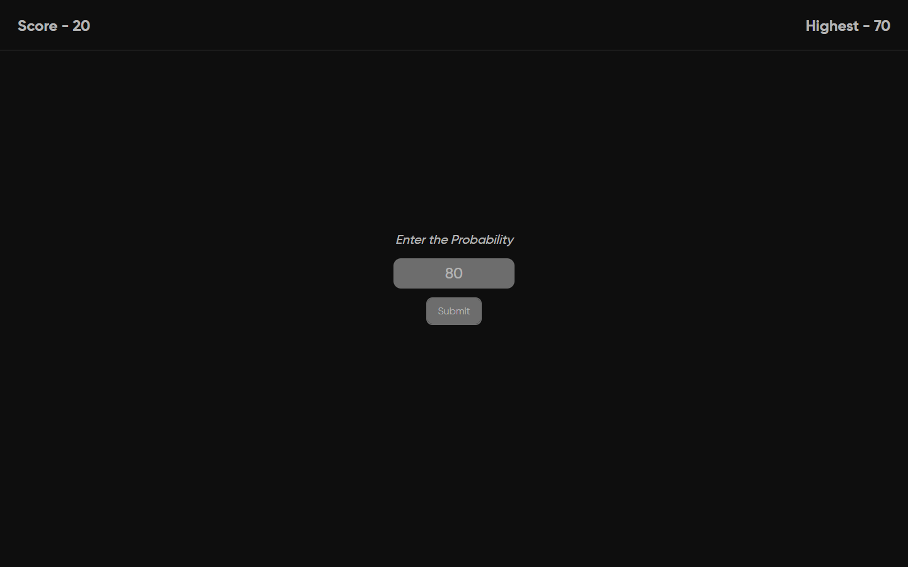
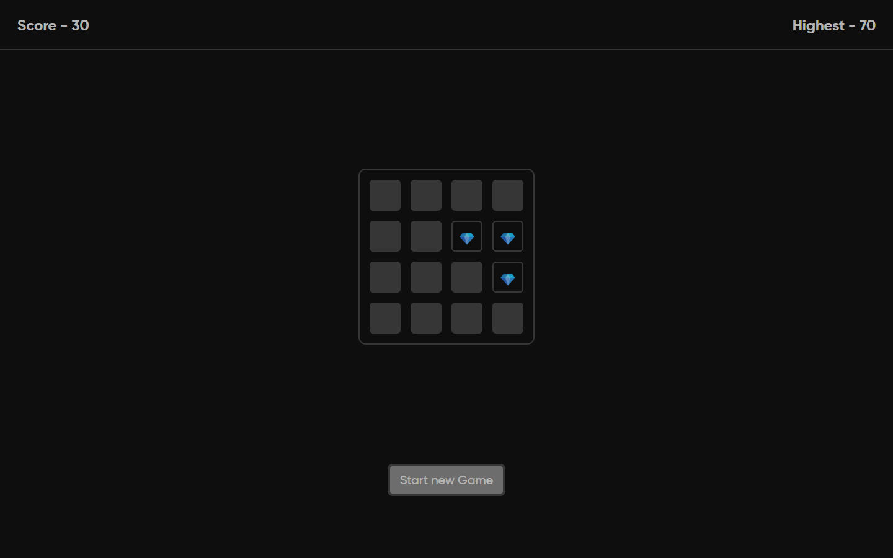
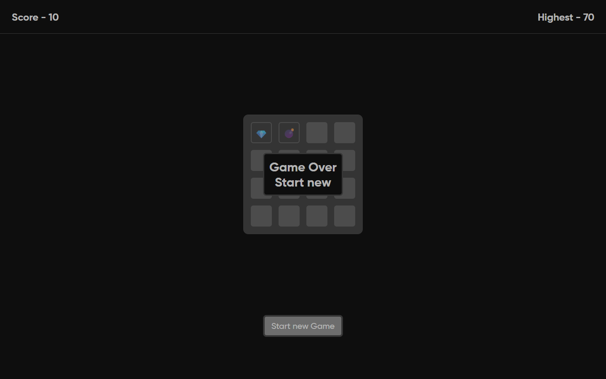

# 📝 Diamond Hunt: React(TS) + Zustand

---
## 📸 Preview

### 🧮 Setup Screen


### 🎯 Gameplay Grid


### 💥 Game Over

---
## 📂 Code Overview

- **File Name:** `mine-game`
- **Structure:**

```
mine-game/
├── index.html
├── package.json
├── tsconfig.json
├── tsconfig.app.json
├── tsconfig.node.json
├── eslint.config.js
├── README.md
├── src/
│   ├── main.tsx
│   ├── index.css
│   ├── vite-env.d.ts
│   ├── App.tsx
│   ├── Components/
│   │   ├── Header.tsx
│   │   ├── GridWrapper.tsx
│   │   └── Cell.tsx
│   ├── Pages/
│   │   └── GameStart.tsx
│   ├── Routes/
│   │   └── AppRoute.tsx
│   └── Store/
│       └── useGameStore.ts
```

The project is a **React-based Minesweeper-style grid game**, using diamonds and mines, built with TypeScript and Vite. It uses Zustand for global state management and React Router for navigation between the setup and gameplay screens.

---

## ✨ Key Features

### 🎮 1. Simple Minesweeper Game Mechanic
- A 4x4 grid representing cells that may contain either a **diamond (💎)** or **bomb (💣)**.
- Clicking a revealed cell:
    - **💎** increases the score.
    - **💣** ends the game.

### ⚙️ 2. Configurable Game Logic
- Players input a **probability value (0–100)** that determines how many diamonds will be randomly placed on the board.

### 💾 3. State Persistence with Zustand
- Uses Zustand with persist and devtools middleware to handle:
    - Grid generation
    - Cell reveal mechanics
    - Score calculation
    - Keeping the highest score across sessions

### 🧭 4. Routing
- `/`: Game setup with probability input
- `/game`: Gameplay screen

### 🖼️ 5. UI and Theming
- Styled using **Tailwind CSS** with a custom dark theme and `Gilroy` font integration.
- Responsive and visually intuitive interface with React components and transitions.

### 🧳 6. Linting and Type Safety
- Configured with ESLint and TypeScript for robust, error-resistant code quality.
- Supports additional React-specific and stylistic lint rules.

---

## 🧑‍💻 Technology Stack

### 💡 Frontend
- **React 19** — Component-based UI.
- **TypeScript** — Type-safe development.
- **React Router 7** — Navigation between views.
- **Tailwind CSS 4** — Utility-first CSS styling.
- **Zustand** — Lightweight state management library.

### ⚙️ Tooling & Build
- **Vite** — High-performance build tool with instant HMR.
- **ESLint + TypeScript ESLint** — Code linting with advanced configuration.
- **SWC/Babel** via Vite plugins — JavaScript/TypeScript compiler.
- **DevTools + Persist** — Zustand middleware for debugging and localStorage state persistence.

### 📦 Runtime & Development Dependencies
Refer to `package.json`, some highlights:
- `@vitejs/plugin-react`
- `react-refresh`
- `eslint-plugin-react-hooks`
- `typescript-eslint`
- `zustand`, `persist`, and `devtools` middlewares

---

## 💻 How to Run Locally

### 🛠️ Prerequisites

Ensure you have installed:
- [Node.js](https://nodejs.org/) (v18 or higher recommended)
- npm (comes with Node.js)

---

### 🚀 Setup & Development

#### **Step 1: Clone the Repository**
```bash
git clone <repository-url>
cd mine-game
```

#### **Step 2: Install Dependencies**
```bash
npm install
```

#### **Step 3: Run Development Server**
```bash
npm run dev
```
> Open `http://localhost:5173` in your browser to view the app.

---

### 🏗️ Build for Production

```bash
npm run build
```

To preview the production build:
```bash
npm run preview
```

---

### ✔️ Linting

```bash
npm run lint
```

---

## 📌 Additional Notes

- **Start Game:** Players must set the probability on the home screen before launching the game.
- **State Persistence:** The highest score is stored using localStorage via Zustand persistent middleware.
- **Tailwind Custom Theme:** Applied via `index.css` using `@theme` variables and `Gilroy` font.
---
Experience **Diamond Hunt** live — no setup required! Just open your browser and start uncovering those diamonds 🔍💎

### 🌐 Live Demo
Deployed and running seamlessly on **Netlify** — check it out here:

> 🔗 [ https://diamond-hunt.netlify.app/ ]  


---

## 📁 References

- Zustand: https://zustand-demo.pmnd.rs/
- Vite: https://vitejs.dev/
- React Router: https://reactrouter.com/
- Tailwind CSS: https://tailwindcss.com/

---

